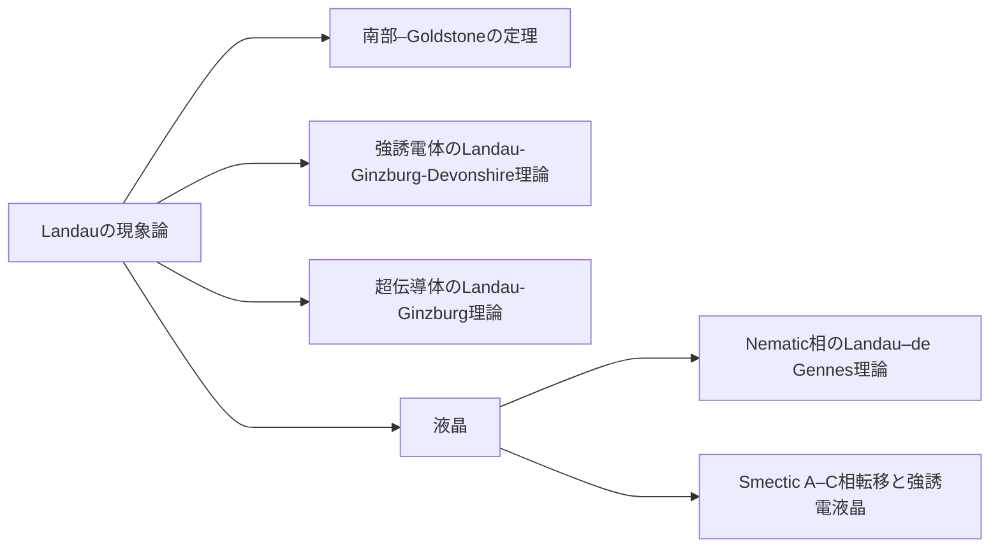

## Landauの現象論
相転移おける対称性の変化：高温相の対称群を$$G_0$$，低温相の対称群を$$G$$とすると，$$G\subset G_0$$である（$$G$$は$$G_0$$の部分群）．つまり，低温相の対称要素は，すべて高温相に含まれる．高温相になく，低温相で新たに現れる対称性がある場合には，Landau理論で記述できない．

対称性秩序変数の選択：高温相の対称群$$G_0$$のある既約表現$$\Gamma_0$$が，低温相の対称群$$G$$に制限することで$$\Gamma, \Gamma_1,\dots$$に既約分解されるとき，その中に$$G$$の全対称表現が含まれているとする．その$$G$$における全対称表現を$$\Gamma$$と書くとき，$$\Gamma$$の基底（函数）$$\eta$$が秩序変数である．なお，$$\Gamma_0$$の選択は一意とは限らないため，この$$\eta$$にも複数の候補があり得る．

現象論的自由エネルギーの式形：（現象論的）自由エネルギー$$F$$を秩序変数$$\eta$$の函数として表す．熱平衡状態における秩序変数$$\eta^\ast$$により，$$F$$は最小化される（と仮定して式形を決める）．つまり，平衡値$$\eta^\ast$$から秩序変数$$\eta$$の値が外れたとき，$$F$$は最小値ではない（$$F(\eta) \ge F(\eta^\ast)$$）．ここで，自由エネルギーを含む完全な熱力学函数は熱平衡状態において定義されることから，平衡値でない$$\eta$$を変数にもつ$$F$$は``自由エネルギー''ではなく，ここでは``現象論的自由エネルギー''と称する．平衡値$$\eta=\eta^\ast$$における$$F(\eta^\ast) = \min_\eta F(\eta)$$は自由エネルギーである．自由エネルギーおよび現象論的自由エネルギーはスカラー量でなくてはならない．スカラー量とは，高温相の対称群$$G_0$$の全対称表現の基底函数である（と仮定する）．つまり，$$G$$のすべての対称要素$$g \in G_0$$について，$$F(\eta)$$は不変である： 
$$
    F(g\eta) = F(\eta)
    .
$$ 

### 簡単な例：常磁性–強磁性相転移
高温相はSO(3)や時間反転操作について不変である．低温相は自発磁化まわりのSO(2)について不変だが時間反転操作で符号を変える．まず回転対称性から考える．SO(3)の既約表現は，球面調和関数を用いることで得ることができる．全対称表現の基底は軌道角量子数$$l=0$$（$$s$$軌道）である．


