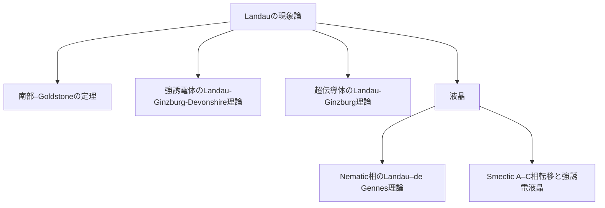

```mermaid
graph TD
    A[Landauの現象論] ---> B[南部–Goldstoneの定理]
    A ---> C[強誘電体のLandau-Ginzburg-Devonshire理論]
    A ---> D[超伝導体のLandau-Ginzburg理論]
    A ---> E[液晶]

    E ---> E1[Nematic相のLandau–de Gennes理論]
    E ---> E2[Smectic A–C相転移と強誘電液晶]
```


