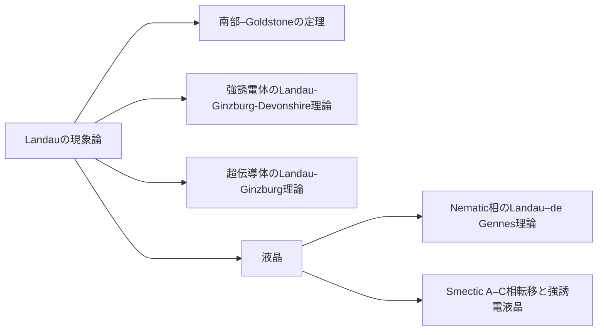

## Landauの現象論
相転移おける対称性の変化：高温相の対称群を$$G_0$$，低温相の対称群を$$G$$とすると，$$G\subset G_0$$である（$$G$$は$$G_0$$の部分群）．つまり，低温相の対称要素は，すべて高温相に含まれる．高温相になく，低温相で新たに現れる対称性がある場合には，Landau理論で記述できない．

対称性秩序変数の選択：高温相の対称群$$G_0$$の既約表現$$\eta_0$$が，低温相の対称群$$G$$に制限することで$$\eta, \eta_1,\dots$$に既約分解されるとき，その中に$$G$$の全対称表現が含まれているとする．その$$G$$における全対称表現を$$\eta$$と書くとき，この$$\eta$$が秩序変数である．なお，$$\eta_0$$の選択は一意とは限らないため，この$$\eta$$にも複数の候補があり得る．


