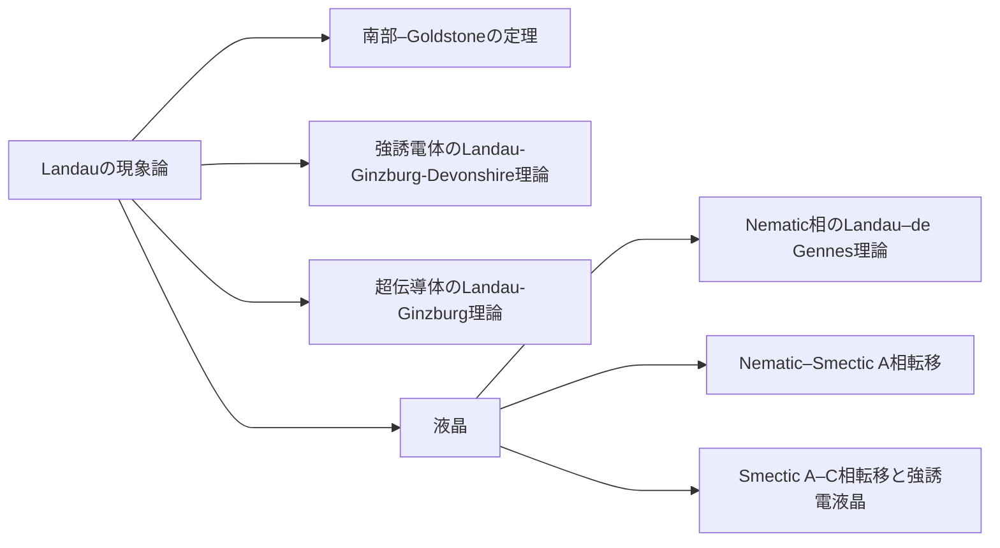

相転移の理解に必要な，相の対称性，対称性の変化としての相転移，現象論的モデルであるLandau理論を学ぶ．後輩・学生・若手研究者仲間で勉強会をする準備として本稿を書き始めた．自分自身が勉強し直すきっかけにもなり，よい機会を得たと感じた．しかし，書き進めるうちに，本稿にどのような存在意義が付されるべきか迷い出してしまった．というのは，対称性の導入からLandau理論の正しい理解までは，一貫して岸根順一郎先生の講義ノートに集約されており，まとめ直したり補足したりする余地が無いように思われたからである．そのため，本稿の構成や，そもそも書き続けるべきか大変悩んだのだが，次を特色にしてみることにした．すなわち，本稿では一般論を簡潔に述べた後，具体的な系を複数例示することで，演繹的・経験的な両面から読者の概念構築を促す．さらに，多様な系で共通の現象論が適用可能であることを示すことにより，系の仔細に拘泥しないLandau理論の普遍性を実感してもらいつつ，要素還元論だけでなく，対称性に立脚した巨視的な視点が複雑な現象の理解に有益であることを学び取ってもらうことを意図して本稿を書き進める．

## Landauの現象論
相転移おける対称性の変化：高温相の対称群を$$G_0$$，低温相の対称群を$$G$$とすると，$$G\subset G_0$$である（$$G$$は$$G_0$$の部分群）．つまり，低温相の対称要素は，すべて高温相に含まれる．高温相になく，低温相で新たに現れる対称性がある場合には，Landau理論で記述できない．

対称性秩序変数の選択：高温相の対称群$$G_0$$のある（全対称表現でない）既約表現$$\Gamma_0$$が，低温相の対称群$$G$$に制限することで$$\Gamma, \Gamma_1,\dots$$に既約分解されるとき，その中に$$G$$の全対称表現が含まれているとする．その$$G$$における全対称表現を$$\Gamma$$と書くとき，$$\Gamma$$の基底（函数）$$\eta$$が秩序変数である．なお，$$\Gamma_0$$の選択は一意とは限らないため，この$$\eta$$にも複数の候補があり得る．秩序変数とは  の解説が納得である．

現象論的自由エネルギーの式形：（現象論的）自由エネルギー$$F$$を秩序変数$$\eta$$の函数として表す．熱平衡状態における秩序変数$$\eta^\ast$$により，$$F$$は最小化される（と仮定して式形を決める）．つまり，平衡値$$\eta^\ast$$から秩序変数$$\eta$$の値が外れたとき，$$F$$は最小値ではない（$$F(\eta) \ge F(\eta^\ast)$$）．ここで，自由エネルギーを含む完全な熱力学函数は熱平衡状態において定義されることから，平衡値でない$$\eta$$を変数にもつ$$F$$は``自由エネルギー''ではなく，ここでは``現象論的自由エネルギー''と称する．平衡値$$\eta=\eta^\ast$$における$$F(\eta^\ast) = \min_\eta F(\eta)$$は自由エネルギーである．自由エネルギーおよび現象論的自由エネルギーはスカラー量でなくてはならない．スカラー量とは，高温相の対称群$$G_0$$の全対称表現の基底函数である（と仮定する）．つまり，$$G$$のすべての対称要素$$g \in G_0$$について，$$F(\eta)$$は不変である：

$$
\begin{equation}
    F(g\eta) = F(\eta)
    .
\end{equation}
$$

### 簡単な例：二次元の強誘電相転移
極性分子から成る二次元系を考える．高温相において極性分子は二次元面内の自由な方向を向いているが，低温相では特定の方向に配向し自発分極をもつとする．すなわち，高温相はSO(2)に対し不変だが，低温相は自明な群SO(1)しか持たない．高温相において，基底函数として$$1$$を選択すると，全対称表現が得られる．これは秩序変数として不適である．しかし，基底函数として$$\{x,y\}$$を選択すると2次元表現が得られる．表現行列はよく知られた回転行列である．低温相では対称群が恒等操作しか含まないため，$$\{x\}$$と$$\{y\}$$がそれぞれ全対称表現の基底となる．他にも，$$\{\cos{\phi}, \sin{\phi}\}$$も同様に振る舞う．よって，基底函数の組み$$\{\cos{\phi}, \sin{\phi}\}$$に係数$$P$$をかけた$$\mathbf{P} = (P_x, P_y)$$を秩序変数に選択する．これは分極と称され，ミクロには，単位体積内の双極子モーメントを足し合わせたものである．

現象論的自由エネルギー$$F$$を求める．Helmoholtzの自由エネルギーを誘導するには，変数として温度$$T$$，体積$$V$$，構成要素の個数$$N$$，秩序変数$$\mathbf{P}$$である．秩序変数である分極$$\mathbf{P}$$は，体積積分することで示量変数として振る舞う．すなわち，

$$
\begin{equation}
    F = F_0 + \int dV\ f(T, N/V; \mathbf{P})
\end{equation}
$$

と書ける．ここに，$$F_0$$は秩序変数$$\mathbf{P}$$が関与しない成分であり，相転移で重要な$$\mathbf{P}$$が関わる（現象論的）自由エネルギー密度$$f$$を分けて書いた．この$$f$$はスカラー量であり，高温相における全対称表現の基底である項から成る．すなわち，秩序変数$$\mathbf{P}$$を用いて全対称表現の基底函数をつくり，それを$$f$$の項とする．ここで，相転移近傍では低温相でも秩序変数は十分小さいと仮定することで，$$f$$を$$\mathbf{P}$$の冪で展開することを考える．特に，相転移を記述可能な最低限の次数までを考慮する．秩序変数$$\mathbf{P}$$がSO(3)についてベクトルとして振る舞うこと，ベクトルの内積がSO(3)におけるスカラー量であることを思い出すと，$$\vert\mathbf{P}\vert^2 = {P_x}^2 + {P_y}^2 = P^2$$は全対称表現の基底である．さらに，その自乗である$$\vert\mathbf{P}\vert^4=P^4$$も基底であることから，

$$
\begin{equation}
    f(T, N/V; \mathbf{P}) = \frac{a}{2} \vert\mathbf{P}\vert^2 + \frac{b}{4} \vert\mathbf{P}\vert^4
\end{equation}
$$

を得る．この表式は2次項と4次項から成る．他の次数，例えば0次項は秩序変数$$\mathbf{P}$$が関与しないため$$F_0$$に繰り込まれており，1次項は高温相において$$
\mathbf{M} = \mathbf{0}$$が平衡値となることを保障するために存在してはならない．また，4次項までがあれば相転移を記述できることから，5次以上の項は除外してある．いまの次数では連続相転移が現れるが，不連続相転移を記述するために6次項を導入する場合もある．なお，3次項は，秩序変数が空間的に一様と仮定する限りは現れない．展開係数は温度$$T$$に依存する．相転移近傍を記述する最低限のモデルでは，$$a(T^\ast) = 0, \frac{da}{dT} < 0, b > 0, \frac{db}{dT} = 0$$を要求すればよい．

熱平衡状態における挙動を調べる．仮定した$$b > 0$$は$$f$$が$$\mathbf{P}$$に対し下に凸であることを保障する．一方，2次項の係数$$a$$は相転移温度$$T^\ast$$において符号反転し，相転移を駆動する．まず，高温相においては$$a > 0$$であることから，$$f$$は自発分極のない$$\mathbf{P} = \mathbf{0}$$において最小値をとる：

$$
\begin{equation}
    \min_{\mathbf{P}} f = f(T > T^\ast, N/V; P = 0) = 0
    .
\end{equation}
$$

低温相では$$a < 0$$であることから，$$P = 0$$は極小点ではなくなり，$$f$$は"メキシカンハット型"のポテンシャル地形を描く．最小値をもたらす秩序変数$$\mathbf{P}$$は，同じ大きさ$$P = \sqrt{-\frac{a}{b}}$$だが，任意の方向（$$\phi$$）をとりうる：

$$
\begin{align}
    \min_{\mathbf{P}} f 
    &= f(T < T^\ast, N/V; P = P_{\text{eq}}) = - \frac{a^2}{4b}
    ,\\
    P_{\text{eq}} 
    &= \sqrt{-\frac{a}{b}}
    .
\end{align}
$$

低温相では自発分極の方向としてひとつの$$\phi$$が出現する．しかし，自由エネルギー的には360度の任意の方向があり得る．このことは，ある$$\phi$$が出現している状態から，任意角度回転させた$$\phi \mapsto \phi' = \phi + \delta\phi$$に変換しても，これもまた熱平衡状態である．つまり，無限小のエネルギーで状態を遷移させることが可能である．一般に，連続対称性が自発的に破れると，無限小のエネルギーで励起可能なモードが発現する．このモードを南部–Goldstoneモードという．南部–Goldstoneモードは素粒子物理学の文脈で提唱されたが，対称性に依拠することから系のスケールに依らず普遍的に現れる．

### 簡単な例：常磁性–強磁性相転移
高温相はSO(3)や時間反転操作について不変である．低温相は自発磁化まわりのSO(2)について不変だが時間反転操作で符号を変える．まず回転対称性から考える．SO(3)の既約表現は，球面調和関数を用いることで得ることができる．全対称表現の基底は軌道角量子数$$l=0$$の$$Y_{0}^{0}$$（$$s$$軌道）である．$$Y_{0}^{0}$$は凡ゆる純粋回転に対し不変である．高温相の全対称表現の基底は秩序変数となれないが，$$l=1$$の$$Y_{1}^{m}, m=\{-1, 0, +1\}$$ ($$p$$軌道）なら可能性がある．この函数はSO(3)において，既約表現の基底の組み$$\{Y_{1}^{-1}, Y_{1}^{0}, Y_{1}^{+1}\}$$を構成する．相転移により$$z$$軸まわりのSO(2)が保たれた場合，既約表現の基底は$$Y_{1}^{0}$$と$$\{Y_{1}^{-1}, Y_{1}^{+1}\}$$に分かれる．基底$$Y_{1}^{0}$$は，SO(2)の全対称表現を与える．すなわち，$$Y_{1}^{0}$$はSO(2)の全ての操作に対し不変である．次に時間反転対称性を考える．高温相は時間反転操作に対し不変であるが，自発磁化をもつ低温相は符号反転する．そこで，時間反転操作による符号反転を球面調和函数に付加した量$$\Upsilon_{l}^{m}$$を，$$\Upsilon_{l}^{m} = Y_{l}^{m}, \mathcal{T}\Upsilon_{l}^{m} = - Y_{l}^{m}$$として導入する．すると，$$\Upsilon_{1}^{0}$$はSO(2)に時間反転を掛け合わせた対称群の全対称表現を与える．よって，$$\{\Upsilon_{1}^{-1}, \Upsilon_{1}^{0}, \Upsilon_{1}^{+1}\}$$に係数をかけた量$$\mathbf{M}$$を秩序変数に選択できる．この量は磁化と称され，ミクロには，単位体積内のスピンを足し合わせたものである．

現象論的自由エネルギー$$F$$を求める．Helmoholtzの自由エネルギーを誘導するには，変数として温度$$T$$，体積$$V$$，構成要素の個数$$N$$，秩序変数$$\mathbf{M}$$である．秩序変数である磁化$$\mathbf{M}$$は，体積積分することで示量変数として振る舞う．すなわち，

$$
\begin{equation}
    F = F_0 + \int dV\ f(T, N/V; \mathbf{M})
\end{equation}
$$

と書ける．ここに，$$F_0$$は秩序変数$$\mathbf{M}$$が関与しない成分であり，相転移で重要な$$\mathbf{M}$$が関わる（現象論的）自由エネルギー密度$$f$$を分けて書いた．この$$f$$はスカラー量であり，高温相における全対称表現の基底である項から成る．すなわち，秩序変数$$\mathbf{M}$$を用いて全対称表現の基底函数をつくり，それを$$f$$の項とする．ここで，相転移近傍では低温相でも秩序変数は十分小さいと仮定することで，$$f$$を$$\mathbf{M}$$の冪で展開することを考える．特に，相転移を記述可能な最低限の次数までを考慮する．秩序変数$$\mathbf{M}$$がSO(3)についてベクトルとして振る舞うこと，ベクトルの内積がSO(3)におけるスカラー量であることを思い出すと，$$\vert\mathbf{M}\vert^2$$は全対称表現の基底である．さらに，その自乗である$$\vert\mathbf{M}\vert^4$$も基底であることから，

$$
\begin{equation}
    f(T, N/V; \mathbf{M}) = \frac{a}{2} \vert\mathbf{M}\vert^2 + \frac{b}{4} \vert\mathbf{M}\vert^4
\end{equation}
$$

を得る．この表式は2次項と4次項から成る．他の次数，例えば0次項は秩序変数$$\mathbf{M}$$が関与しないため$$F_0$$に繰り込まれており，1次項は高温相において$$
\mathbf{M} = \mathbf{0}$$が平衡値となることを保障するために存在してはならない．また，4次項までがあれば相転移を記述できることから，5次以上の項は除外してある．いまの次数では連続相転移が現れるが，不連続相転移を記述するために6次項を導入する場合もある．なお，3次項は，秩序変数が空間的に一様と仮定する限りは現れない．展開係数は温度$$T$$に依存する．相転移近傍を記述する最低限のモデルでは，$$a(T^\ast) = 0, \frac{da}{dT} < 0, b > 0, \frac{db}{dT} = 0$$を要求すればよい．

熱平衡状態における挙動を調べる．仮定した$$b > 0$$は$$f$$が$$\mathbf{M}$$に対し下に凸であることを保障する．一方，2次項の係数$$a$$は相転移温度$$T^\ast$$において符号反転し，相転移を駆動する．まず，高温相においては$$a > 0$$であることから，$$f$$は磁化のない$$\mathbf{M} = \mathbf{0}$$において最小値をとる：

$$
\begin{equation}
    \min_{\mathbf{M}} f = f(T > T^\ast, N/V; \mathbf{M} = \mathbf{0}) = 0
    .
\end{equation}
$$

低温相では$$a < 0$$であることから，$$\mathbf{M} = \mathbf{0}$$は極小点ではなくなり，$$f$$は"メキシカンハット型"のポテンシャル地形を描く．最小値をもたらす秩序変数$$\mathbf{M}$$は，同じ大きさ$$\vert\mathbf{M}\vert = \sqrt{-\frac{a}{b}}$$だが，任意の方向をとりうる：

$$
\begin{align}
    \min_{\mathbf{M}} f 
    &= f(T < T^\ast, N/V; \mathbf{M} = \mathbf{M}_{\text{eq}}) = - \frac{a^2}{4b}
    ,\\
    \vert\mathbf{M}_{\text{eq}}\vert 
    &= \sqrt{-\frac{a}{b}}
    .
\end{align}
$$

## 液晶の相転移とLandau理論
液晶の相転移にもLandau理論は適用可能である．むしろ相互作用が複雑で，理想気体のように分子の運動が自由ではないのに，理想結晶のようにサイトが固定されているわけではない，凝縮した流動相である液晶を理解する上で，マクロな対称性に立脚したLandau理論は相性が良い．もちろん，分子の個性を反映することは難しいが，分子個々の特質を超えた普遍的な相としての挙動を捉えることができる．

### Nematic相のLandau–de Gennes理論
Nematic相と等方相の相転移を考える．（一軸性）Nematic相は点群$$D_{\infty\text{h}}$$の対称性をもつ．すなわち，SO(2)および$\infty$回軸に垂直な任意の軸まわりの$2$回回転について不変である．一方の等方相は，超群である点群$$K_{\text{h}}$$の対称性をもつ．なお，アキラルな場合には$$\text{h}$$ももつ．

秩序変数として，$$l=1$$（$$p$$軌道）を選択できるか考える．確かに，$$\{Y_{1}^{-1}, Y_{1}^{0}, Y_{1}^{+1}\}$$は自発分極のようなベクトル状の秩序を表現できそうだが，$$\infty$$回軸に垂直な任意軸まわりの$$2$$回回転に対し符号反転する．つまり，低温相（Nematic相）の全対称表現の基底になり得ないため，秩序変数として不適である．

その次に低次の$$l=2$$（$$d$$軌道）では，5つの函数の組み$$\{Y_{2}^{-2}, Y_{2}^{-1}, Y_{2}^{0}, Y_{2}^{+1}, Y_{2}^{+2}\}$$が基底となる．低温相においては，$$Y_{2}^{0}$$（$$d_{z^2}$$軌道）が$$D_{\infty\text{h}}$$における全対称表現の基底となる．よって，秩序変数は$$Y_{2}^{m}$$の線型結合である．具体的には，実トレースレス対称テンソル$$Q$$である．$$Q$$テンソルは，SO(3)の5次元表現の基底である．詳細な導出には，Peter–Weylの定理を用いる．

秩序変数である$$Q$$テンソルを用いて現象論的自由エネルギーを求める．高温相はSO(3)に対し不変であることから，その全対称表現をもたらす基底函数には$$\text{Tr}Q^n$$がある．ここに，$$n$$は自然数である．トレースはテンソル不変量と呼ばれるスカラー量である．ここで，$$Q$$テンソルがトレースレスであることを思い出すと，$$\text{Tr}Q = 0$$は展開項に含めても無意味である．よって，$$n\ge2$$の項を導入すると，

$$
\begin{equation}
    f(T,N/V; Q) = \frac{A}{2} \text{Tr} Q^2 + \frac{B}{3} \text{Tr} Q^3 + \frac{C}{4} \left(\text{Tr} Q^2\right)^2
\end{equation}
$$

が得られる．これまで見てきた系との最大の違いは，3次項$$\text{Tr}Q^3$$の存在である．偶数次の項からなる現象論的自由エネルギーでは，連続相転移が記述されたが，3次項を含むこの$$f$$は不連続相転移を示す．ここで，一軸性Nematic相では，$$Q$$テンソルをスカラー秩序変数$$S$$とダイレクタ（極性ベクトル）$$\mathbf{n}$$に分解することが可能である：

$$
\begin{equation}
    Q_{ij} = \frac{3}{2} S \left(n_i n_j - \frac{1}{3}\delta_{ij}\right)
    .
\end{equation}
$$

これを$$f$$に代入すると，

$$
\begin{equation}
    f = \frac{3A}{4}S^2 + \frac{B}{4}S^3 + \frac{9C}{16}S^4
\end{equation}
$$

を得る．展開係数を制約する．係数$$A, B, C$$のいずれにも温度依存性がありうるが，相転移を記述するには$$A$$にのみ温度依存性を導入すればよい．具体的には，$$A(T^\ast) = 0, \frac{dA}{dT} > 0$$とする．さらに，現象論的自由エネルギーが$$S\ge0$$において最小値をもつために$$C > 0$$，相転移を引き起こすために$$B < 0$$を仮定する．なお，計算を簡単にするために不連続相転移を諦めて$$B = 0$$を仮定する場合もある．

さて，スカラー秩序変数$$S$$の平衡値を求める．十分高温では$$S=0$$のみが極小となるが，温度低下に伴い，$$S > 0$$に極小が出現し低温相が生じうる．すると，安定状態ではないが低温相がはじめて現れる．この温度を昇温過程でみると，低温相が完全に消失する温度であり，透明点$T^{\text{c}}$と称される．このとき，$$S=0$$のみが極小になることから，

$$
\begin{equation}
    \frac{df}{dS} = \frac{9C}{4}S\left(\frac{2A}{3C} + \frac{B}{3C}S + S^2\right)
\end{equation}
$$

の$$()$$内が重解になる．つまり．

$$
\begin{equation}
    A(T^{\text{c}}) = \frac{B^2}{24C} > 0
\end{equation}
$$

において，$$S > 0$$がはじめて極小になる（ギリギリならない）．さらに温度を下げると低温相の現象論的自由エネルギーが低下し，高温相と一致する．この温度を相転移温度$$T_0$$とする．このとき，$$f(S)$$は双安定となる．このことは，$$f$$を

$$
\begin{equation}
    f = \frac{3A}{4}S^2\left(1 + \frac{B}{3A}S + \frac{3C}{4A}S^2\right)
\end{equation}
$$

と表したとき，$$()$$内が重解をもつ条件と等価である．すなわち，

$$
\begin{equation}
    A(T_0) = \frac{B^2}{27C} > 0
\end{equation}
$$

である．低温相の秩序変数は

$$
\begin{equation}
    S ^\ast = - \frac{2B}{9C} > 0
\end{equation}
$$

であり，不連続相転移が生じる．相転移温度において秩序変数が不連続に変化するのみならず，高温相と低温相が共存しうる．不連続相転移は3次項（$$B<0$$）に起因する．秩序変数が$$Q$$テンソルであることが3次項を許容することから，Nematic–等方相転移の不連続性はNematic秩序に由来する．さらに温度を下げると低温相が安定相となる．これより低温でも高温相が存在しうるが，高温相が極小にもなり得ないとき，$$f \sim S^3 (S \sim 0)$$である．これは$$A(T^\ast) = 0$$である：

$$
\begin{equation}
    f = \frac{B}{4}S^3\left(1 + \frac{9C}{4B}S\right)
    .
\end{equation}
$$

### Nematic–Smectic A相転移
Nematic相は，長距離的な配向秩序があるが，結晶のような周期的な位置秩序をもたない相である．液晶には，1次元方向に層構造をもつSmectic相が知られている．特に，Smectic A相は，ダイレクタ方向に分子位置の周期構造をもつ．逆に言えば，層法線と平行にダイレクタが向いている．Smectic A相はミクロ構造に応じて細分化されるが，点群$$D_{\infty}$$に属する．これはNematic相と同じ点群である．Nematic相とSmectic A相を区別するのは，ダイレクタ方向の周期的な分子位置秩序である．密度分布函数$$\rho(\mathbf{x})$$をFourier変換

$$
\begin{equation}
    \rho (\mathbf{x}) = \rho_0 + \delta \rho \cos{2\pi dz} + c.c.
\end{equation}
$$

### Smectic A–C相転移と強誘電液晶
Smectic A相では分子が層法線方向に配向しているが，Smectic C相では分子が層法線から傾いている．Smectic A–C相転移では，分子の傾きを論じる．興味深いことに，秩序変数はダイレクタと直交方向に選ぶ．さらに，鏡映対称性の破れたSmectic C$$^\ast$$相は強誘電性を示す，すなわち強誘電流体である．Smectic C$$^\ast$$相の自発分極は，ダイレクタと直交した層面内方向に生じる．これは，秩序変数がダイレクタではないことと関係している．

ここからは，強誘電液晶への敷衍を念頭に，キラルな液晶相を想定する．Smectic A$$^\ast$$相は点群$$D_{\infty}$$に属する．ここで，$$\infty$$回軸は層法線方向を向いている．Smectic C$$^\ast$$相は点群$$C_2$$に属する．仮に，秩序変数としてダイレクタ$$\mathbf{n} = (n_x, n_y, n_z)$$を選択してみると，低温相において$$\{n_z\}$$と$$\{n_x, n_y\}$$に分解される．しかし，いずれも低温相における全対称表現の基底にならない．なぜなら，層面内の軸まわりの$$2$$回回転で符号反転するからである．そこで，ダイレクタを層面内外に直交分解した$$n_z$$と$$(n_x, n_y, 0)$$の外積をとり，$$\mathbf{\xi} = (-n_z n_y, +n_z n_x)$$を考える．ここで，層法線方向の成分は恒等的に$$0$$であるため省略した．チルト方向を面内に射映し，これを$$x$$軸にとると，$$n_z n_x$$が全対称表現の基底となる．よって，$$\mathbf{\xi}$$を秩序変数として選択する．

$$
\begin{equation}
    f = \frac{a}{2} \vert\mathbf{\xi}\vert^2 + \frac{b}{4} \vert\mathbf{\xi}\vert^4
\end{equation}
$$

いま選んだ秩序変数$$\mathbf{\xi}$$はダイレクタにも層法線にも直交しており，層面内の$$2$$回軸と平行である．$$C_2$$における自発分極の方向は$$2$$回軸方向に他ならないことから，$$\mathbf{\xi}$$は自発分極の方向を示している．ただし，注意が必要だが，$$\mathbf{\xi}$$は配向秩序により定義される量であり，自発分極を表す物理量ではない．この事情は，相転移や強誘電性の発現に重要である．液晶相においては，極性分子間の双極子–双極子相互作用は相の発現を駆動できるほど強くはない．むしろ分子のパッキングといった形状的な理由で相転移が生じ，強誘電性は相の対称性に由来する副産物という帰来がある．これは，近年発見された，分子長軸方向に自発分極を示す強誘電Nematic相でも同様である．


