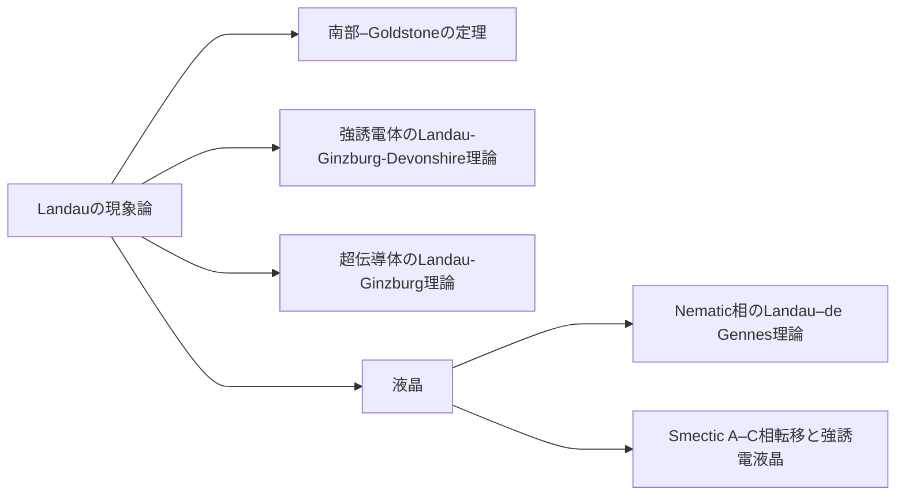

## Landauの現象論
相転移おける対称性の変化：高温相の対称群を$$G_0$$，低温相の対称群を$$G$$とすると，$$G\subset G_0$$である（$$G$$は$$G_0$$の部分群）．つまり，低温相の対称要素は，すべて高温相に含まれる．高温相になく，低温相で新たに現れる対称性がある場合には，Landau理論で記述できない．

対称性秩序変数の選択：高温相の対称群$$G_0$$のある（全対称表現でない）既約表現$$\Gamma_0$$が，低温相の対称群$$G$$に制限することで$$\Gamma, \Gamma_1,\dots$$に既約分解されるとき，その中に$$G$$の全対称表現が含まれているとする．その$$G$$における全対称表現を$$\Gamma$$と書くとき，$$\Gamma$$の基底（函数）$$\eta$$が秩序変数である．なお，$$\Gamma_0$$の選択は一意とは限らないため，この$$\eta$$にも複数の候補があり得る．

現象論的自由エネルギーの式形：（現象論的）自由エネルギー$$F$$を秩序変数$$\eta$$の函数として表す．熱平衡状態における秩序変数$$\eta^\ast$$により，$$F$$は最小化される（と仮定して式形を決める）．つまり，平衡値$$\eta^\ast$$から秩序変数$$\eta$$の値が外れたとき，$$F$$は最小値ではない（$$F(\eta) \ge F(\eta^\ast)$$）．ここで，自由エネルギーを含む完全な熱力学函数は熱平衡状態において定義されることから，平衡値でない$$\eta$$を変数にもつ$$F$$は``自由エネルギー''ではなく，ここでは``現象論的自由エネルギー''と称する．平衡値$$\eta=\eta^\ast$$における$$F(\eta^\ast) = \min_\eta F(\eta)$$は自由エネルギーである．自由エネルギーおよび現象論的自由エネルギーはスカラー量でなくてはならない．スカラー量とは，高温相の対称群$$G_0$$の全対称表現の基底函数である（と仮定する）．つまり，$$G$$のすべての対称要素$$g \in G_0$$について，$$F(\eta)$$は不変である：

$$
    F(g\eta) = F(\eta)
    .
$$

### 簡単な例：常磁性–強磁性相転移
高温相はSO(3)や時間反転操作について不変である．低温相は自発磁化まわりのSO(2)について不変だが時間反転操作で符号を変える．まず回転対称性から考える．SO(3)の既約表現は，球面調和関数を用いることで得ることができる．全対称表現の基底は軌道角量子数$$l=0$$の$$Y_{0}^{0}$$（$$s$$軌道）である．$$Y_{0}^{0}$$は凡ゆる純粋回転に対し不変である．高温相の全対称表現の基底は秩序変数となれないが，$$l=1$$の$$Y_{1}^{m}, m={-1, 0, +1}$$ ($$p$$軌道）なら可能性がある．この函数はSO(3)において，既約表現の基底の組み$$\{Y_{1}^{-1}, Y_{1}^{0}, Y_{1}^{+1}\}$$を構成する．相転移により$$z$$軸まわりのSO(2)が保たれた場合，既約表現の基底は$$Y_{1}^{0}$$と$$\{Y_{1}^{-1}, Y_{1}^{+1}\}$$に分かれる．基底$$Y_{1}^{0}$$は，SO(2)の全対称表現を与える．すなわち，$$Y_{1}^{0}$$はSO(2)の全ての操作に対し不変である．次に時間反転対称性を考える．高温相は時間反転操作に対し不変であるが，自発磁化をもつ低温相は符号反転する．そこで，時間反転操作による符号反転を球面調和函数に付加した量$$\Upsilon_{l}^{m}$$を，$$\Upsilon_{l}^{m} = Y_{l}^{m}, \mathcal{T}\Upsilon_{l}^{m} = - Y_{l}^{m}$$として導入する．すると，$$\Upsilon_{1}^{0}$$はSO(2)に時間反転を掛け合わせた対称群の全対称表現を与える．よって，$$\{\Upsilon_{1}^{-1}, \Upsilon_{1}^{0}, \Upsilon_{1}^{+1}\}$$に係数をかけた量$$\mathbf{M}$$を秩序変数に選択できる．この量は磁化と称され，ミクロには，単位体積内のスピンを足し合わせたものである．

現象論的自由エネルギー$$F$$を求める．Helmoholtzの自由エネルギーを誘導するには，変数として温度$$T$$，体積$$V$$，構成要素の個数$$N$$，秩序変数$$\mathbf{M}$$である．秩序変数である磁化$$\mathbf{M}$$は，体積積分することで示量変数として振る舞う．すなわち，

$$
    F = F_0 + \int dV\ f(T, N/V; \mathbf{M})
$$

と書ける．ここに，$$F_0$$は秩序変数$$\mathbf{M}$$が関与しない成分であり，相転移で重要な$$\mathbf{M}$$が関わる（現象論的）自由エネルギー密度$$f$$を分けて書いた．この$$f$$はスカラー量であり，高温相における全対称表現の基底である項から成る．すなわち，秩序変数$$\mathbf{M}$$を用いて全対称表現の基底函数をつくり，それを$$f$$の項とする．ここで，相転移近傍では低温相でも秩序変数は十分小さいと仮定することで，$$f$$を$$\mathbf{M}$$の冪で展開することを考える．特に，相転移を記述可能な最低限の次数までを考慮する．秩序変数$$\mathbf{M}$$がSO(3)についてベクトルとして振る舞うこと，ベクトルの内積がSO(3)におけるスカラー量であることを思い出すと，$$\vert\mathbf{M}\vert^2$$は全対称表現の基底である．さらに，その自乗である$$\vert\mathbf{M}\vert^4$$も基底であることから，

$$
    f(T, N/V; \mathbf{M}) = \frac{a}{2} \vert\mathbf{M}\vert^2 + \frac{b}{4} \vert\mathbf{M}\vert^4
$$

を得る．この表式は2次項と4次項から成る．他の次数，例えば0次項は秩序変数$$\mathbf{M}$$が関与しないため$$F_0$$に繰り込まれており，1次項は高温相において$$
\mathbf{M} = \mathbf{0}$$が平衡値となることを保障するために存在してはならない．また，4次項までがあれば相転移を記述できることから，5次以上の項は除外してある．いまの次数では連続相転移が現れるが，不連続相転移を記述するために6次項を導入する場合もある．なお，3次項は，秩序変数が空間的に一様と仮定する限りは現れない．展開係数は温度$$T$$に依存する．相転移近傍を記述する最低限のモデルでは，$$a(T^\ast) = 0, \frac{da}{dT} < 0, b > 0, \frac{db}{dT} = 0$$を要求すればよい．

熱平衡状態における挙動を調べる．仮定した$$b > 0$$は$$f$$が$$\mathbf{M}$$に対し下に凸であることを保障する．一方，2次項の係数$$a$$は相転移温度$$T^\ast$$において符号反転し，相転移を駆動する．まず，高温相においては$$a > 0$$であることから，$$f$$は磁化のない$$\mathbf{M} = \mathbf{0}$$において最小値をとる：

$$
    \min_{\mathbf{M}} f = f(T > T^\ast, N/V; \mathbf{M} = \mathbf{0}) = 0
    .
$$

低温相では$$a < 0$$であることから，$$\mathbf{M} = \mathbf{0}$$は極小点ではなくなり，$$f$$は"メキシカンハット型"のポテンシャル地形を描く．最小値をもたらす秩序変数$$\mathbf{M}$$は，同じ大きさ$$\vert\mathbf{M}\vert = \sqrt{-\frac{a}{b}}$$だが，任意の方向をとりうる：

$$
    \min_{\mathbf{M}} f = f(T < T^\ast, N/V; \mathbf{M} = \mathbf{M}_{\text{eq}}) = - \frac{a^2}{4b}
    .
$$

$$
    \vert\mathbf{M}_{\text{eq}}\vert = \sqrt{-\frac{a}{b}}
$$


